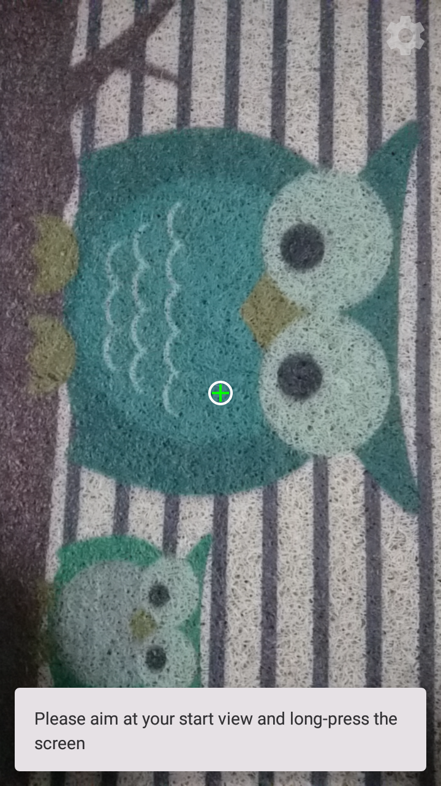
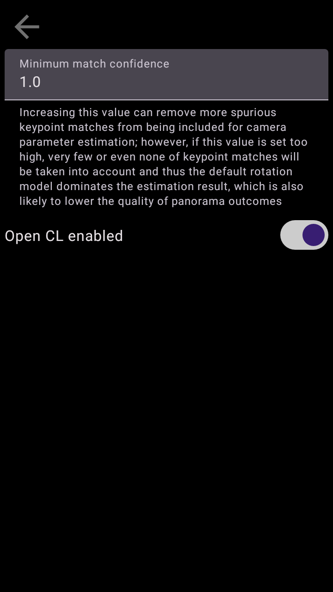

# AndroidPanorama
This is an Android app for creating panoramas, written in Kotlin and built upon libraries including
* Jetpack Compose
* Jetpack CameraX
* OpenCV (version 4.7.0, accessed through [JavaCPP Presets](https://github.com/bytedeco/javacpp-presets))

## Limitations
Please note that this work is purely for experimenting without thorough tests on its stability/compatibility/functionality;
so there is no guarantee of the performance and the quality of outputs.

## Features
1. A picture-capturing procedure through which users are guided to take pictures (12 in total) covering necessary angles for establishing a panorama view
2. The information about camera rotations enforced by feature 1 is incorporated into the estimation process for camera parameters to improve the quality of the estimate

## Notes
1. Camera binding/the rotation sensor listener is not released/unregistered when the app goes to the background in the middle of the picture-taking process. This allows camera configuration (exposure and white balance in particular) and rotation reports from the sensor to stay consistent after users temporarily switch to other apps and then back; however, that implies once the picture-taking process has been started, the required resource/power for the functions of the camera/rotation sensors will always be consumed, even if the app is in the background.
2. OpenCV has provided a convenient helper class (opencv_stitching.Stitcher) capable of producing panoramas regardless of how the input images are taken, but being input agnostic in generating panoramas can sometimes hurt the output quality in cases where inputs contain noisy keypoint matches and hence the camera parameters would be badly estimated (or cannot even be estimated at all). To alleviate that, this implementation leverages the fact that the presence of feature 1 ensures the relative pose of the camera at which each picture is taken, and that pose information (which is approximated via a sequence of rotations enforced by feature 1) is exploited to initialise/constrain the optimisation process for locating the final camera parameters. As a result, the actual stitching flow, while derived from opencv_stitching.Stitcher, contains various changes plus a customised optimisation process and does not involve the direct use of that helper class.
3. It has been found that enabling OpenCL support that comes with OpenCV can halt UI updates on my device. Although this only imposes a minimum/neglectable impact on the current UI design of this app, a switch is added to the setting page (tap the gear icon at the top-right corner to enter) to allow users to turn it on/off at will, in case this feature becomes a source of instability on some devices.

## Screenshots

